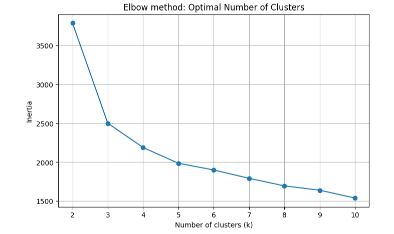
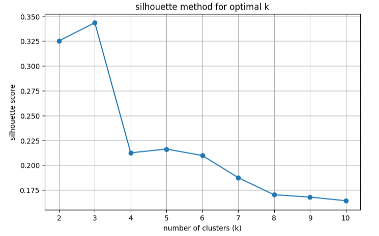
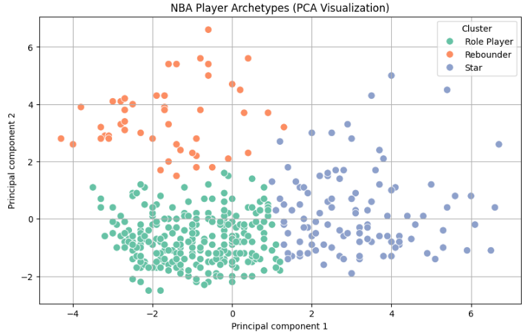
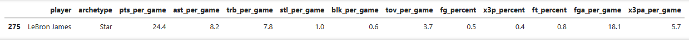

# NBA Player Archetype Clustering 

This project uses unsupervised machine learning to cluster NBA players from the 2025 season into **archetypes** based on their per-game statistics. The result is a visual and statistical breakdown of players into groups such as **Stars**, **Role Players**, and **Rebounders**.

Using player performance data from the 2025 NBA season: 
- Filter and cleaned data
- Selected key per-game stats for clustering
- Applied **K-Means clustering** to identify natural groupings in data
- Used **PCA** to visualize player clusters in 2D space

---

## How to Run

1. **Clone the repo**
    - `git clone https://github.com/justinvuongg/nba-archetype-clustering.git`
    - `cd nba-archetype-clustering`
2. **Create and activate virutal environment**
    - `python -m venv venv`
    - `source venv/bin/activate (Mac/Linus) OR venv\Scripts\activate (windows)`
3. **Install Dependencies**
    - `pip install -r requirements.txt`
4. **Open the notebook**
    - `juypter notebook notebooks/nba_archetype_clustering.ipynb`

---

## Optimal Number of Clusters (k)

Initially, I used the **Elbow Method** to determine the optimal number of clusters, which plots within-clusters inertia (error) for increasing values of k. However, the elbow plot didn't show a clear inflection point. 
I then switched to the **Silhouette Score**, which measures how well-separated, the clusters are. This score peaked at around 3, which offered the best combination of separation and interability. 

#### Elbow Method

#### Silhouette Score

---

### Final PCA Cluster Visualization

After selecting k=3, I applied **PCA** to reduce 11 statistical features into 2 dimensions for visualization. This scatterplot shows the resulting player clusters, which were later labeled with interpretable archetypes. 

## Example Use Case

get_archetype("lebron james")

